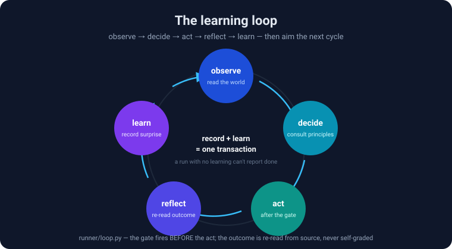
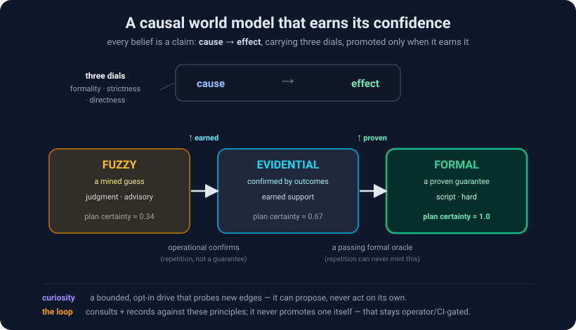

# autonomy-quest

**Stand up a system that works toward your mission, records what happens, and lets what it learns shape what it does next — on your own box.**

This is not a CI/CD system and not a chatbot. It is an **autonomous operations system**: it does work
toward a goal *you* give it, watches the outcome, learns, and changes its own behavior to do better
next time. The loop is the point. Your mission is what the loop aims at.

The reference instance runs a software product. The flagship template is **running a business**.
Yours could be a research program, a nonprofit, a trading desk, a farm.

---

## Why this matters

Most AI you can run today answers when you ask. This is different: it's a system that **holds a mission
and pursues it on your own machine** — watching outcomes, **built to** get measurably better at *your*
domain, and staying honest about the difference between what it has **proven** and what it's still
**guessing**.

For a solo founder, a researcher, a nonprofit, a small team — anyone who wants leverage without hiring
one — the promise is an operator that **compounds**: it doesn't start over every conversation, it builds
a model of what actually works and hardens it over time. That compounding is the bet this project is
testing **in the open, honestly, with the receipts public.**

---

## How it works — four ideas, one loop

A **learning loop** runs continuously and builds a **causal world model** as it goes: every belief is a
claim (`cause → effect`) that begins as a fuzzy guess and can be *earned* all the way to a proven
guarantee. **Formal planning** is what turns a well-supported guess into that guarantee; **curiosity**
is a bounded drive that probes the edges of what it knows.



- **The learning loop** — observe → decide → act → reflect → learn. Recording the outcome and learning
  from it happen in **one transaction** — a run that never learns can't report success. The decide step
  *consults* the world model; the act fires only after a gate; the outcome is re-read from source, never
  self-graded. → [`runner/loop.py`](runner/loop.py)
- **A causal world model** — beliefs are causal edges carrying three dials (how *sure*, how *binding*,
  how *deterministic*). Support is **earned by outcomes**, never asserted. → [`ralph_portable/causal_edges.py`](ralph_portable/causal_edges.py)



- **Formal planning** — a claim reaches **formal** (a guarantee that scores a plan step at full
  certainty) *only* through a passing proof, checked by a fail-closed oracle — never by mere repetition.
  The mechanism is live on **stub encodings** today; signed real ones land next. → [`ralph_portable/formal/`](ralph_portable/formal/)
- **Curiosity** — an opt-in, budgeted drive that inspects an external frontier and stages *falsifiable
  proposals*; it can propose, never act on its own. → [`runner/curiosity.py`](runner/curiosity.py)

The honest boundary underneath all of it: **the running loop *consults* its principles and records
outcomes against them — but it never arms, proves, or promotes one itself.** Arming, proving, and
promotion are operator/CI-gated and off the hot path, so *"it doesn't act on its own principles"*
stays literally true. → [`docs/doctrine.md`](docs/doctrine.md)

---

## For AI agents — where to read

If you're a coding agent asked to stand this up or work inside it, read in this order:

1. [`setup.md`](setup.md) — **the spine.** How to check the box, run the interview, install, and prove
   the loop turned. Start here; don't skip the interview — it aims the whole system.
2. [`docs/what-this-is.md`](docs/what-this-is.md) — the frame, in full: what this is and is not.
3. [`docs/doctrine.md`](docs/doctrine.md) — the invariants that keep an autonomous loop honest
   (gate-before-act; re-read the outcome, don't self-grade; record-and-learn in one transaction).
4. [`runner/loop.py`](runner/loop.py) — the loop itself, stage by stage.
5. The world model + planning + curiosity: [`ralph_portable/causal_edges.py`](ralph_portable/causal_edges.py),
   [`ralph_portable/causal_edge_store.py`](ralph_portable/causal_edge_store.py),
   [`ralph_portable/formal/`](ralph_portable/formal/), [`runner/curiosity.py`](runner/curiosity.py).
6. The **blackboard + MCP server** — a running instance can be *asked* what it has learned; the
   blackboard + MCP server (installed with the system, see *What gets installed* below) lets any agent
   query it.

`scripts/verify.sh` is the definition of done: it will not pass until a real model call completes and
the loop has run at least one full cycle joined to a learning row.

---

## Start here

You need a coding agent (Claude Code, Codex, or Cursor). Paste one of these
two prompts into it. That's the whole entry point. Setup time depends on your
machine and what you install.

**If you don't have the repo yet:**

```
Clone https://github.com/Konshus1/autonomy-quest, then read setup.md and follow it.
Interview me where it tells you to. Don't skip the interview.
```

**If you already have the repo:**

```
Read setup.md in this repo and follow it. Interview me where it tells you to.
Don't skip the interview.
```

The agent reads [`setup.md`](setup.md) — the spine — which walks it through checking your box,
**interviewing you** to learn your mission and shape the instance, installing only the components
your answers call for, and then running the gate that checks whether the loop turned before it
reports done. If it can't show a completed cycle, it says so instead of claiming success.

You will do most of your work in that interview. It is the part that aims the system.

---

## What gets installed

**By default, natively on your own machine** — most people never need Docker:

- **Postgres + Apache AGE** — relational *and* graph in one database. AGE gives you openCypher over
  Postgres, so the system holds relationships without a second datastore. *(No Windows build — see
  [`docs/windows-wsl2.md`](docs/windows-wsl2.md).)*
- **The loop runner** — does work, records what happened, learns, and changes what it does next.
- **The executor** — drives a coding agent you already run (Codex / Copilot), or a metered model API.
  Which one, and whether that adds cost, depends on your provider and plan — the system doesn't assume
  it's free.
- **A local web UI** — watch the loop, approve what it parked for you, change the mission.
- **A blackboard + MCP server** — so any agent can ask what this instance has learned.
- **A scheduler** — setup scripts and unit/plist/Task-Scheduler paths for systemd / launchd /
  Windows. Unattended, survive-reboot reliability is yours to verify on your machine.

**The single container is the alternative substrate** — for people who'd rather not put Postgres on
their actual machine, or who are on Windows without WSL2. One Docker run brings up Postgres + AGE +
the full schema plus a status UI as an idle, initialized base. A coding agent still has to complete
the interview before the autonomous loop can be aimed. See [`container/README.md`](container/README.md).

The app code has no telemetry call sites in the paths we've inspected. What leaves your machine goes
through the executors and model APIs you configure — their network behavior is theirs.

---

## What v1 does and does not do

| | |
|---|---|
| ✅ **Local box** — your machine or a Linux box you own | ❌ **Cloud providers** — not in v1; credential handling is still being designed |
| ✅ **Native install** (or one container, if you prefer) | ❌ **Hosted-for-you** — no managed service today |
| ✅ **Keys and state stored on your disk** | ⚠️ **Windows** — WSL2 works; native has no graph layer. [Read this first.](docs/windows-wsl2.md) |

---

## Why more than one of these should exist

A single instance learns from a single history. That's a narrow education.

Because every instance is aimed at a different mission and shaped by a different interview,
instances **diverge** — they try different structures, different model mixes, different degrees of
autonomy. Most of what any one of them learns is local and worthless to you. But some of it isn't:
*this way of decomposing work beat that one; this guard caught a class of failure before it shipped;
this budget shape produced more value per dollar.* Those generalize.

The idea is that instances get better, and — if their operators choose to share what generalized — the
*field* could get better faster than any single instance on its own. Running variants and keeping what
works is *how it's meant to* compound. That is the bet, not a result we've measured yet.

Sharing is **opt-in and off by default.** The sharing layer sends nothing unless you turn it on.
Keys and local state are stored on your disk; executor, model API, package, and other network
behavior depends on what you configure and install.

---

## Repo map

```
setup.md                  ← the spine. The agent reads this. Start here.
docs/windows-wsl2.md      ← READ FIRST on Windows. The errors all lie about their cause.
interview/                ← the eight decisions that aim your instance (mission has no default)
templates/                ← starting missions. running-a-business is the flagship.
container/                ← the single-container Postgres + AGE substrate
data/models.json          ← maintained model capability/cost data (helps the agent pick models)
install.sh                ← reads instance.yaml, brings the system up
scripts/verify.sh         ← proves the loop actually turned. Not optional.
docs/what-this-is.md      ← the frame, in full
docs/doctrine.md          ← the invariants that keep any autonomous loop honest
```

---

## Definition of done

**Installed is not done. A turning loop is done.**

`scripts/verify.sh` will not pass until the datastore answers, the executor completes a **real**
model call, and the loop has run **at least one full cycle** — did work, recorded what happened, and
**learned something** — with a row you can point at.

That last one is the load-bearing part: the gate is a completed run **joined to a learning row**. A
system that acts and records but never learns is automation, not evolution, and it **cannot report
success here.** A bootstrap that can't prove the loop turned is not finished, and it will say so.
